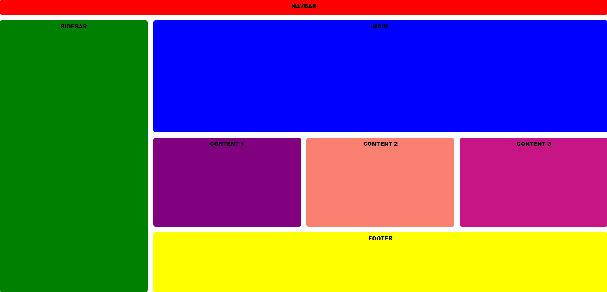
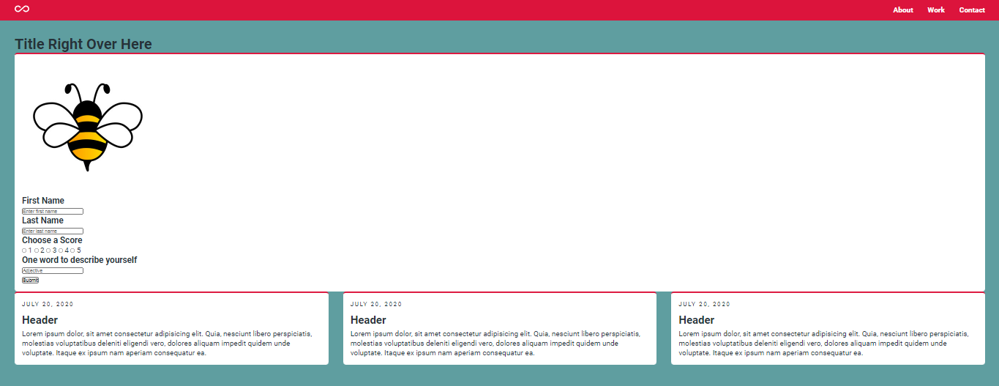

# flask-project (Work In Progress...)


## Description
<p>Flask app sends data to the Postgres database and emails user
</p>

#

<br>

## Requirements
```
- python >= 3.5
- SQLAlchemy
- Postgres
- Flask
```

#

## Getting started w/ Bash
```
** git clone https://github.com/WackyChomp/flask-project.git

** cd flask-project

** py -m venv .venv

** . venv/bin/activate

** pip install -r requirements.txt

** export FLASK_APP = app

** flask run
```

## Getting started w/ Visual Studio Code
```
** py -m venv .venv

** . venv/bin/activate

** app.py
```

#

## Setting up the deployment
```
Work in Progress...
```

#

## Layout Idea


## Current Progress
